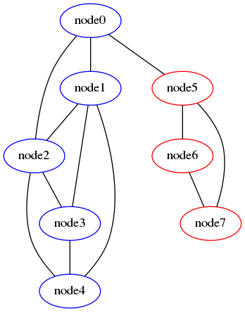

# Spectral Graph Partitioning Algorithm

## What ?

This is a Python implementation of the Spectral Partitioning Algorithm and can
be used to partition a graph in two communities (minimize the number of edges
between the cuts and try to create communities of similar sizes).

## How ?

You will need `numpy` (and `dot` if you want to generate the graph).

    python3 partitioning.py

Full documentation:

    $ python3 partitioning.py -h                                                                                                              (:
    usage: partitioning.py [-h] [--nodes-file NODES_FILE]
                        [--output-file OUTPUT_FILE]

    Compute the partition of a graph using the Spectral Partition Algorithm.

    optional arguments:
    -h, --help            show this help message and exit
    --nodes-file NODES_FILE, -f NODES_FILE
                         the file containing the nodes
    --output-file OUTPUT_FILE, -o OUTPUT_FILE
                         the filename of the communities PNG graph to be
                         written

## Graph output file

This algorithm will produce a graph using `dot`:

